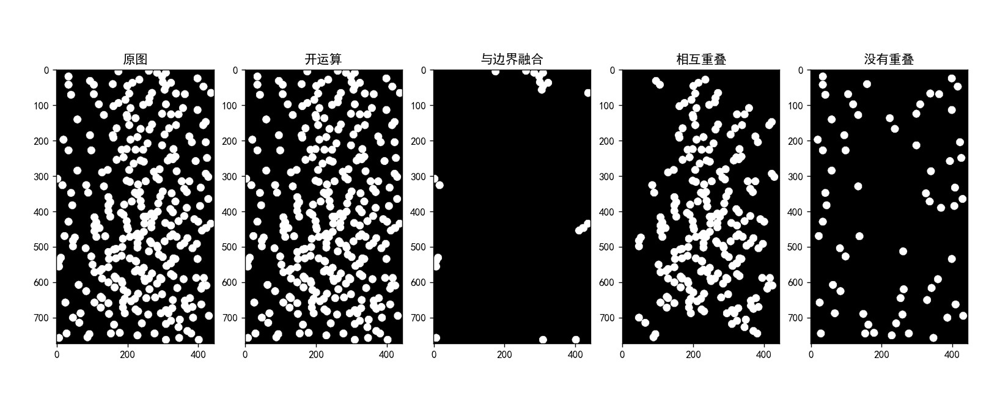

<!--
 * @Author: LetMeFly
 * @Date: 2022-06-13 15:00:00
 * @LastEditors: LetMeFly
 * @LastEditTime: 2022-06-13 16:08:18
-->
# MorphologicalAlgorithm_ParticleSegmentation

形态学算法 - 颗粒分割

项目地址：[https://github.com/LetMeFly666/MorphologicalAlgorithm_ParticleSegmentation](https://github.com/LetMeFly666/MorphologicalAlgorithm_ParticleSegmentation)

在线文档： [https://maps.letmefly.xyz](https://maps.letmefly.xyz/)

## 问题描述

显微应用中一个预处理步骤是从两组或更多组重叠的类似颗粒（见右图）中分离出单个独立的一种颗粒。假设所有颗粒的大小相同，提出一种产生3幅图像的形态学算法，这3幅图像分别仅由如下物体组成：

+ (a) 仅与图像边界融合在一起的颗粒
+ (b) 仅彼此重叠的颗粒
+ (c) 没有重叠的颗粒


## 具体方法：

拿到图像后，首先进行二值化处理，然后进行一个开运算。

本项目用Python实现。到此为止，图像(numpy.array)中的数据只有0和255

由此我们可以使用opencv中自带的连通块划分函数，将不同的颗粒(块)划分为不同的连通块（记为“标签图片”）。

比如：

```
0000000000
0011000200
0010022203
0000022003
0000000000
```

+ 0是黑色的区域
+ 1是一个白色的颗粒（面积比较小，只有3，因此应该只有单个颗粒）
+ 2是一个白色的颗粒块（面积比较大，有6，因此推测有多个颗粒重叠到了一起）

然后，我们就可以根据划分出来的连通块，来区分不同类型的颗粒了。

### 与边界重合的颗粒

我们只需要遍历一下4个边界。如果一个颗粒与边界重合(边界上出现了不为0的标签)，那么我们就记录下这个颗粒的标签。

例如上面小图的3。

之后遍历一遍图像，并新建一个全为0的大小相同的图像（记为“边界图像”），找到标签图片中是“3”的位置，把边界图像中对应位置记为255。

这样，我们就提取出了**边界颗粒**。

### 相互重叠的颗粒

提取出了边界颗粒后，我们用开运算后的图像减去边界图像，只研究未分类的剩余颗粒。

假设一个颗粒的面积大约为3，那么我们只需要统计每个种类的标签的像素个数，＞3的就视为是**有重叠的颗粒**。

### 单个的颗粒

提取出了相互重叠的颗粒后，只需要拿剩余颗粒减去有重叠的颗粒，就能得到**单独的颗粒**。

## 代码实现

```Python
'''
Author: LetMeFly
Date: 2022-06-12 23:28:36
LastEditors: LetMeFly
LastEditTime: 2022-06-13 15:01:56
'''
import matplotlib.pyplot as plt
import numpy as np
import os
import cv2

# 避免plt警告
os.environ["QT_DEVICE_PIXEL_RATIO"] = "0"
os.environ["QT_AUTO_SCREEN_SCALE_FACTOR"] = "1"
os.environ["QT_SCREEN_SCALE_FACTORS"] = "1"
os.environ["QT_SCALE_FACTOR"] = "1"

# 支持中文显示
plt.rcParams[ 'font.sans-serif' ] = [ 'SimHei' ]

# 读入图像
img = cv2.imread("img/9.36.jpg", 0)
rows, cols = img.shape

# 二值化
_, img_binary = cv2.threshold(img, 127, 255, cv2.THRESH_BINARY)
img_open = cv2.morphologyEx(img_binary, cv2.MORPH_OPEN, kernel=cv2.getStructuringElement(cv2.MORPH_RECT, (3, 3)))  # 开运算
img_open_backup = img_open.copy()

# 把图像分成一个个连通块儿
num, img_label = cv2.connectedComponents(img_open)
labels = [i for i in range(1, num)]

bounded_labels = set()  # 处在边界的标签
for col in range(cols):
    if img_label[0][col]:
        bounded_labels.add(img_label[0][col])
    if img_label[rows - 1][col]:
        bounded_labels.add(img_label[rows - 1][col])
for row in range(rows):
    if img_label[row][0]:
        bounded_labels.add(img_label[row][0])
    if img_label[row][cols - 1]:
        bounded_labels.add(img_label[row][cols - 1])

# 与边界重合的部分
img_bounds = np.zeros((rows, cols), dtype=np.uint8)
for row in range(rows):
    for col in range(cols):
        if img_label[row][col] in bounded_labels:
            img_bounds[row][col] = 255
img_open -= img_bounds

# 获取各个标签的面积
area_dict = {}
for label in labels:
    area_dict[label] = 0
for row in range(rows):
    for col in range(cols):
        if img_open[row][col]:
            area_dict[img_label[row][col]] += 1

# 设置单个颗粒的面积阈值
single_area = 420  # 经过调试，420是个不错的选择

# 相互重叠的图像（面积 > 单个颗粒的图像）
img_overlap = np.zeros((rows, cols), np.uint8)
for row in range(rows):
    for col in range(cols):
        if img_label[row][col] and area_dict[img_label[row][col]] > single_area:
            img_overlap[row][col] = 255

# 剩下的就是单个颗粒的部分
img_single = img_open - img_overlap

# 显示结果
_, ax_list = plt.subplots(1, 5, figsize=(20, 10))
ax_list[0].set_title("原图")
ax_list[0].imshow(img, cmap="gray")
ax_list[1].set_title("开运算")
ax_list[1].imshow(img_open_backup, cmap="gray")
ax_list[2].set_title("与边界融合")
ax_list[2].imshow(img_bounds, cmap="gray")
ax_list[3].set_title("相互重叠")
ax_list[3].imshow(img_overlap, cmap="gray")
ax_list[4].set_title("没有重叠")
ax_list[4].imshow(img_single, cmap="gray")
plt.show()
```

## 实现结果



> 同步发文于CSDN，原创不易，转载请附上[原文链接](https://maps.letmefly.xyz)哦~
> Tisfy：[https://letmefly.blog.csdn.net/article/details/125258729](https://letmefly.blog.csdn.net/article/details/125258729)